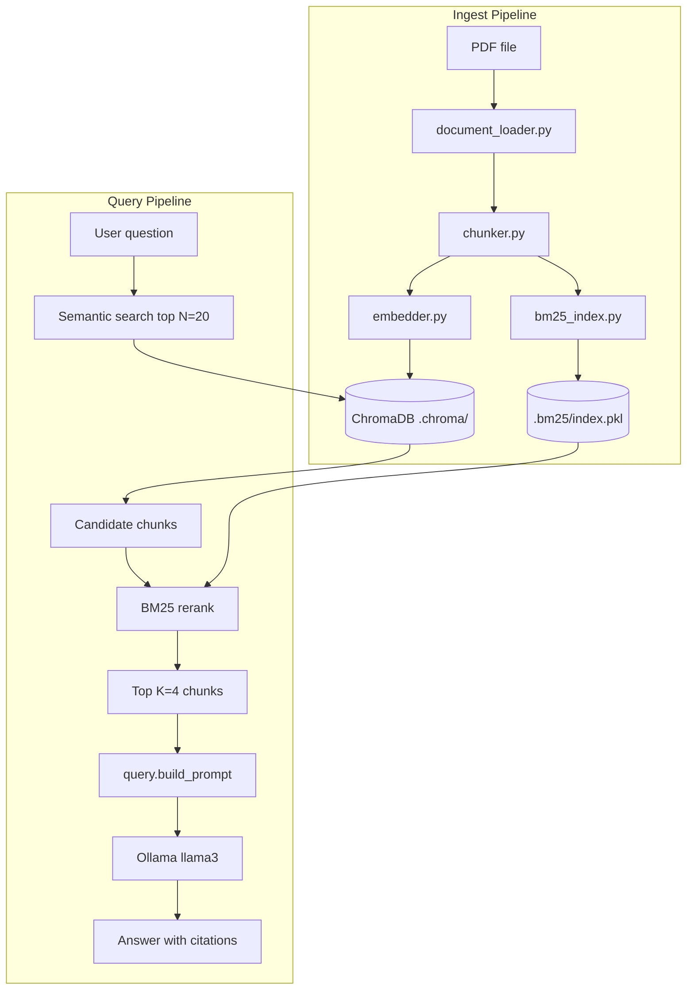

# PolicyPulse Architecture

PolicyPulse is a local hybrid RAG pipeline for insurance policy PDF Q&A. It combines dense vector retrieval with BM25 reranking before sending context to Llama 3.

## Pipeline overview



## Ingest flow

1. **Load** — `document_loader.py` extracts text from PDF (pypdf) or TXT files.
2. **Chunk** — `chunker.py` uses LangChain `RecursiveCharacterTextSplitter` (500 chars, 50 overlap).
3. **Embed** — `embedder.py` calls Ollama `nomic-embed-text` for each chunk.
4. **Store** — `vector_store.py` writes embeddings + metadata to ChromaDB.
5. **Index BM25** — `bm25_index.py` rebuilds a full-corpus BM25 index and saves to `.bm25/index.pkl`.

Each chunk ID follows the pattern `{filename}-{chunk_index}` (e.g. `sample-policy.pdf-12`).

## Query flow

1. **Semantic retrieval** — Embed the question, query ChromaDB for the top **20** candidates by cosine distance.
2. **BM25 rerank** — Score those 20 candidates using the persisted BM25 index; return the top **4**.
3. **Generate** — Build a prompt with numbered policy excerpts and call Ollama `llama3`.

Pass `--no-rerank` to skip step 2 and use semantic ranking only — useful for comparing retrieval quality.

## Module responsibilities

| Module | Role |
|--------|------|
| `config.py` | Models, chunk sizes, paths, retrieval constants |
| `document_loader.py` | PDF/TXT loading entry point |
| `chunker.py` | Recursive text splitting |
| `embedder.py` | Ollama embedding calls |
| `vector_store.py` | ChromaDB CRUD and similarity search |
| `bm25_index.py` | Build, persist, load, and rerank with BM25Okapi |
| `retriever.py` | Orchestrates semantic search + optional BM25 rerank |
| `query.py` | Prompt building and Llama 3 generation |
| `main.py` | CLI: ingest, search, ask, status, reset |

## Retrieval strategy

**Retrieve-then-rerank** is used instead of parallel fusion:

- Semantic search casts a wide net (N=20) to capture conceptually related sections.
- BM25 reranking boosts chunks with exact keyword matches (`deductible`, `Section 4.2`, `mold`).
- Only K=4 chunks reach the LLM to stay within context limits.

For policy-sized corpora (hundreds of chunks), a full-corpus BM25 index rebuilt at ingest time is fast and simple.

## Storage layout

```
.chroma/          # ChromaDB persistent vector store
.bm25/index.pkl   # Pickled BM25 records (id, text, metadata)
data/             # Copy of ingested source files
```

## External dependencies

| Component | Provider |
|-----------|----------|
| Embeddings | Ollama (`nomic-embed-text`) |
| LLM | Ollama (`llama3`) |
| Vector DB | ChromaDB (local) |
| BM25 | `rank-bm25` library |

## Future extensions

- Hybrid score fusion (RRF) instead of retrieve-then-rerank
- Cross-encoder reranking (e.g. ms-marco-MiniLM)
- MCP server for Cursor integration
- OCR for scanned policy PDFs
- Multi-turn conversation memory
