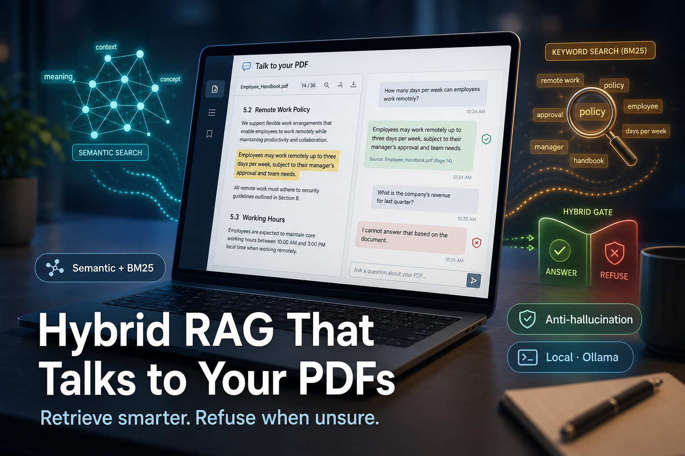
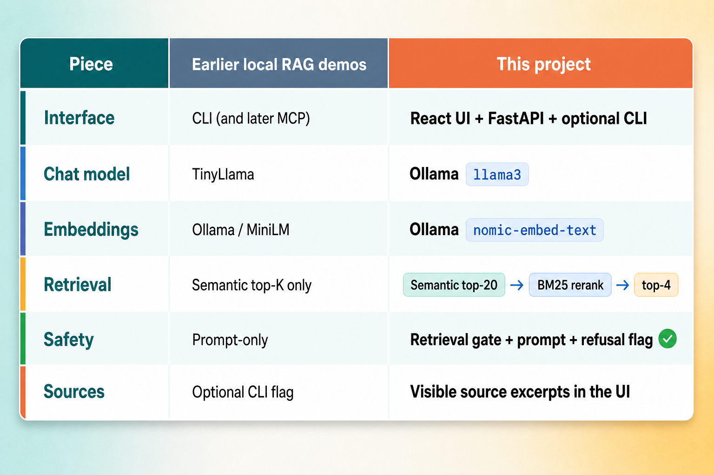
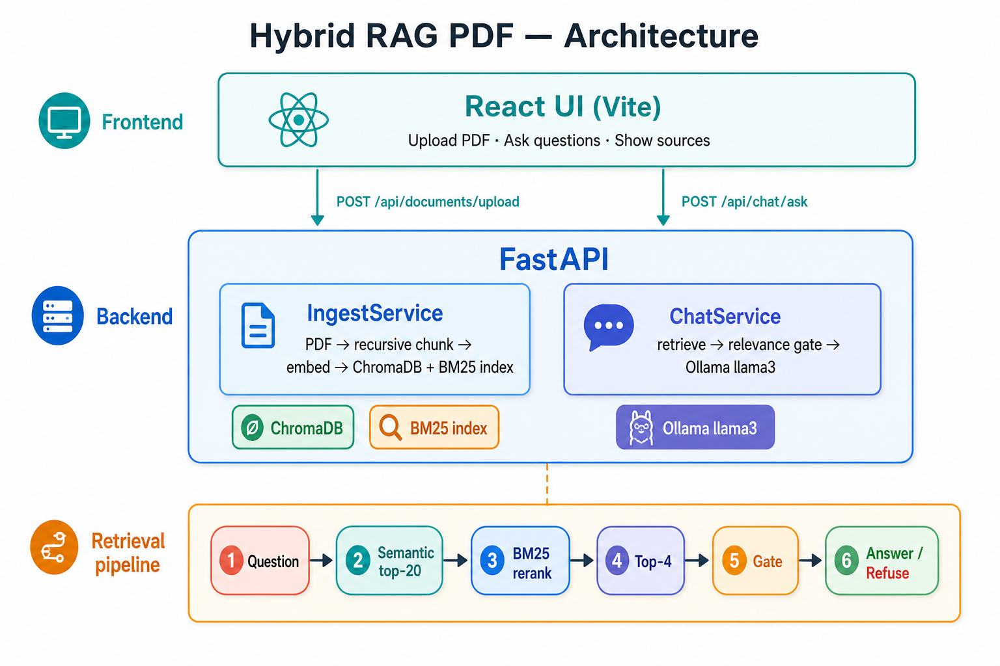
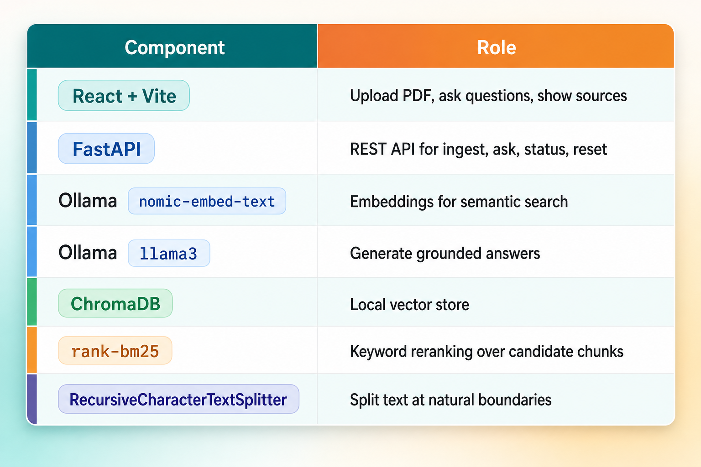

# I Built a Hybrid RAG App That Talks to My PDFs — and Knows When to Say “I Don’t Know”



Imagine you upload an insurance policy PDF and ask:

*"What is my wind/hail deductible?"*

A good RAG system should find the exact clause and answer from it.

Now ask:

*"What is the capital of France?"*

A *confident* RAG system is dangerous here. The document has nothing about France. But a chatty LLM will happily invent an answer unless you stop it.

That tension — **find the right passage** and **refuse when there is none** — is what this project is about.

I built a full-stack **Talk to your PDF** app on my laptop: React UI, FastAPI backend, Ollama (`llama3` + `nomic-embed-text`), ChromaDB, and **BM25 reranking**. The twist is hybrid retrieval plus a simple anti-hallucination gate, so out-of-scope questions get a polite decline instead of a confident guess.

## What is hybrid RAG, in plain English?

**RAG** means: find relevant pieces of your documents, then ask an LLM to answer using those pieces.

**Hybrid RAG** means: do not rely on only one way of finding those pieces.

Think of searching a library two ways at once:

1. **Semantic search (vectors)** — “find sections that *mean* something like my question”
2. **Keyword search (BM25)** — “find sections that contain the *exact words* I care about”

Semantic search is great when you ask about “storm damage” and the policy says “wind/hail.” Keyword search is great when you need the word `deductible`, a section number, or a precise policy term.

Hybrid RAG uses both strengths. In this project, that looks like:

1. Cast a wide semantic net (top 20 chunks from ChromaDB)
2. Rerank those candidates with BM25
3. Send only the best few (top 4) to the LLM

Meaning finds the neighborhood. Exact terms pick the right house.

## What is anti-hallucination, in plain English?

**Hallucination** is when an AI answers with confidence even though it does not actually know — or when the answer is not supported by your document.

**Anti-hallucination** is the set of guardrails that reduce that behavior.

In plain English: it is how you teach the system to say *“I don’t know from this document”* instead of making something up.

In this app, anti-hallucination is not one magic trick. It is three simple layers:

1. **Retrieval gate** — if the best retrieved chunks look weakly related (by semantic distance and BM25 score), refuse *before* calling the LLM
2. **Strict prompt** — tell the model to answer only from the excerpts, and to say it cannot answer otherwise
3. **Post-check** — if the model still replies with “cannot answer,” mark the response as refused

You still see source excerpts in the UI. That matters. Trust comes from evidence, not from a fluent paragraph.

## Why I cared about this

Earlier local RAG experiments taught me the basic loop: ingest → chunk → embed → retrieve → generate.

That loop works. But two practical problems kept showing up with real policy-style documents:

1. **Semantic-only retrieval missed exact terms.** Questions about deductibles, exclusions, and section numbers needed keyword precision.
2. **Small models love to fill gaps.** If retrieval was weak, the LLM still tried to sound helpful.

So I built a demo that feels closer to a real product:

- Upload a PDF in the browser
- Ask questions in a chat-style UI
- See grounded answers with source snippets
- Watch out-of-scope questions get declined

Still fully local. Still no API keys.

## A real example: hybrid retrieval in action

Suppose your policy PDF contains something like:

```
Section 4.2 — Wind/Hail Deductible

For losses caused by windstorm or hail, a separate deductible of $2,500 applies.
This deductible is independent of the standard all-peril deductible in Section 3.1.
Mold remediation is excluded except where resulting from a covered water peril.
```

**Question A:** *"What is my wind/hail deductible?"*

- Semantic search finds conceptually related coverage sections
- BM25 boosts chunks that literally contain `wind`, `hail`, and `deductible`
- Llama 3 answers from the top excerpts: **$2,500**, with the section context

**Question B:** *"What is the capital of France?"*

- Retrieved chunks are about insurance language, not geography
- Relevance scores fail the gate
- The app refuses without inventing Paris — or pretending the policy somehow mentioned it

That second case is the demo moment I care about most. A RAG demo that only answers in-document questions is incomplete. A RAG demo that **declines** out-of-scope questions is teaching the right instinct.

## What changed in this project



| Piece | Earlier local RAG demos | This project |
|-------|-------------------------|--------------|
| Interface | CLI (and later MCP) | React UI + FastAPI + optional CLI |
| Chat model | TinyLlama | Ollama `llama3` |
| Embeddings | Ollama / MiniLM | Ollama `nomic-embed-text` |
| Retrieval | Semantic top-K only | Semantic top-20 → BM25 rerank → top-4 |
| Safety | Prompt-only | Retrieval gate + prompt + refusal flag |
| Sources | Optional CLI flag | Visible source excerpts in the UI |

The big idea is not “more models.” It is **better retrieval + clearer refusal**.

## Two search methods, one pipeline

### 1. Semantic search — ChromaDB + nomic-embed-text

The embedding model turns each chunk (and your question) into a vector. ChromaDB finds the nearest neighbors by meaning.

This is how *"storm damage"* can still find *"wind/hail"* language.

### 2. BM25 rerank — exact-term boost

BM25 is a classic keyword ranking method. It rewards chunks that contain the query terms, with sensible weighting for term rarity and document length.

In policy documents, that helps questions like:

- “mold coverage”
- “Section 4.2”
- “wind/hail deductible”

### 3. Why retrieve-then-rerank?

I used a simple pattern:

```
Question
  → embed
  → semantic top-20 candidates
  → BM25 rerank
  → top-4 chunks
  → anti-hallucination gate
  → llama3 answer (or polite refusal)
```

Semantic search casts a wide net. BM25 chooses the best fish. The LLM only sees a short, high-signal context window.

You can disable reranking (`use_rerank: false` / `--no-rerank`) to compare quality side by side. That comparison alone is a useful learning exercise.

## The architecture I built

I kept the RAG core small and wrapped it with a web API and React frontend.



```
React UI (Vite)
  │  POST /api/documents/upload
  │  POST /api/chat/ask
  ▼
FastAPI
  ├── IngestService  → PDF → recursive chunk → embed → ChromaDB + BM25 index
  └── ChatService    → retrieve → relevance gate → Ollama llama3

Retrieval pipeline:
  Question → semantic top-20 → BM25 rerank → top-4 → gate → answer / refuse
```



| Component | Role |
|-----------|------|
| React + Vite | Upload PDF, ask questions, show sources |
| FastAPI | REST API for ingest, ask, status, reset |
| Ollama `nomic-embed-text` | Embeddings for semantic search |
| Ollama `llama3` | Generate grounded answers |
| ChromaDB | Local vector store |
| rank-bm25 | Keyword reranking over candidate chunks |
| RecursiveCharacterTextSplitter | Split text at natural boundaries |

Everything runs on one machine. No Docker required for the demo. No documents leave your laptop.

Full diagrams: see `docs/architecture.md` in the repo.

## How the pipeline works

### Step 1: Upload and ingest

PDF → extract text → recursive chunk (~500 chars, 50 overlap) → embed → store in ChromaDB → rebuild BM25 index

From the UI, this is a drag-and-drop upload. Under the hood, FastAPI calls the same ingest path the CLI uses.

### Step 2: Ask an in-document question

Question → semantic candidates → BM25 rerank → relevance gate passes → Llama 3 answers from excerpts → UI shows answer + source snippets (semantic rank, BM25 score, distance)

### Step 3: Ask an out-of-scope question

Same retrieval path — but the gate fails. The API returns a refusal message and marks `refused: true`. No invented facts. No fake confidence.

### Step 4: Inspect sources

Every answer (and many refusals) can show the chunks that were considered. That is how you debug RAG honestly: look at what was retrieved before blaming the model.

## The core code

### Hybrid retrieve-then-rerank

```python
def retrieve(question, store, bm25, *, top_k=4, use_rerank=True):
    candidates = store.query(question, top_k=20)
    if not candidates:
        return []

    if not use_rerank:
        return candidates[:top_k]

    return bm25.rerank(question, candidates, top_k=top_k)
```

Wide semantic recall first. Precise keyword ordering second.

### Anti-hallucination relevance gate

```python
def assess_relevance(chunks):
    if not chunks:
        return False, REFUSAL_MESSAGE

    best_distance = min(chunk["distance"] for chunk in chunks)

    if best_distance <= STRONG_SEMANTIC_DISTANCE:
        return True, ""

    if best_distance > MAX_SEMANTIC_DISTANCE:
        return False, REFUSAL_MESSAGE

    best_bm25 = max(
        (chunk.get("bm25_score") or 0.0) for chunk in chunks
    )
    if best_bm25 < MIN_BM25_SCORE:
        return False, REFUSAL_MESSAGE

    return True, ""
```

If retrieval looks strong, proceed. If it looks off-topic, refuse early. If it is borderline, require some keyword overlap before trusting the LLM.

### Strict generation prompt

```python
SYSTEM_PROMPT = """You are a document Q&A assistant.
Answer questions using ONLY the provided document excerpts.
If the answer is not stated in the excerpts, respond with exactly:
"I cannot answer that based on the document."
Do not use outside knowledge. Do not guess or invent facts.
"""
```

Prompting alone is not enough. Combined with the retrieval gate, it becomes a practical safety net for a local demo.

### Tunable knobs in one place

```python
LLM_MODEL = "llama3"
EMBED_MODEL = "nomic-embed-text"
CHUNK_SIZE = 500
CHUNK_OVERLAP = 50
RETRIEVAL_CANDIDATES = 20
TOP_K = 4
STRONG_SEMANTIC_DISTANCE = 280
MAX_SEMANTIC_DISTANCE = 450
MIN_BM25_SCORE = 0.5
```

Tighten the distance thresholds if you want fewer hallucinations and more refusals. Loosen them if you want fewer false declines on paraphrased questions.

## What the app looks like to use

### Web demo

1. Start the API: `uvicorn api.main:app --reload --port 8000`
2. Start the UI: `npm run dev` in `frontend/`
3. Open http://localhost:5173
4. Upload `data/sample-policy.pdf`
5. Ask 2–3 in-document questions
6. Ask one out-of-scope question and watch it decline

### CLI (still useful for debugging)

```
python main.py ingest data/sample-policy.pdf
python main.py ask "What is my wind/hail deductible?" --show-sources
python main.py search "mold coverage" --no-rerank
python main.py status
```

I kept the CLI because retrieval debugging is faster in the terminal. The React UI is for the product story. Both share the same core services.

## Project structure

```
hybrid-rag-pdf/
├── api/                      # FastAPI REST layer
│   ├── main.py
│   └── schemas.py
├── frontend/                 # React + Vite SPA
├── rag/
│   ├── config.py             # models, chunking, retrieval thresholds
│   ├── chunker.py            # recursive splitting + overlap
│   ├── document_loader.py    # PDF/TXT loading
│   ├── embedder.py           # Ollama embeddings
│   ├── vector_store.py       # ChromaDB
│   ├── bm25_index.py         # build, persist, rerank
│   ├── retriever.py          # semantic + BM25 orchestration
│   ├── anti_hallucination.py # relevance gate
│   ├── query.py              # prompt + generate + sources
│   └── services/
│       ├── ingest_service.py
│       └── chat_service.py
├── main.py                   # CLI
├── data/sample-policy.pdf
└── docs/architecture.md
```

Clear layers made the project easier to explain — and easier to extend later.

## What I noticed while building this

**BM25 is surprisingly useful on policy language.** Exact terms matter. Vector search alone often got “close enough.” Reranking made “exactly right” more common.

**Refusal is a feature, not a failure.** Early versions of RAG demos feel broken when they say “I cannot answer.” For document Q&A, that is often the correct product behavior.

**Sources make the demo trustworthy.** Showing excerpts, ranks, and scores turns a black-box answer into something a reader can verify in seconds.

**Llama 3 raised answer quality**, but retrieval and gating still did the heavy lifting. A stronger model on weak context is still a confident storyteller.

**A web UI changes how people understand RAG.** Watching upload → ask → grounded answer → refusal is more memorable than reading CLI output.

## Who is this for?

This kind of project is great if you are:

- Learning **hybrid retrieval** (semantic + BM25) with a real demo
- Building a **Talk to your PDF** experience on a laptop
- Exploring **anti-hallucination** as practical engineering, not buzzwords
- Preparing for interviews where RAG architecture and grounding come up
- Looking for a local stack: Python, React, Ollama, ChromaDB

You do not need a GPU farm. You need Python, Node.js, Ollama, and one text-based PDF.

## What is next?

Natural extensions from here:

- **Conversation memory** — follow-up questions across turns
- **Streaming answers** — token-by-token responses in the UI
- **Stronger rerankers** — cross-encoders when keyword boost is not enough
- **OCR for scanned PDFs** — so image-only policies work too
- **Eval harness** — a golden Q&A set that measures grounded answers *and* correct refusals

Even without those upgrades, the current demo already teaches the lesson I wanted: **good RAG is retrieval quality plus the courage to refuse.**

## Final thought

Vector search finds meaning. Keyword search finds precision. Together they make retrieval sharper.

But the quiet hero of this project is the refusal path.

Anyone can build a chatbot that always answers. The more interesting system is the one that answers from your PDF when the evidence is there — and says *“I cannot answer that based on the document”* when it is not.

If you try this yourself, do one complete loop:

1. Upload one policy PDF
2. Ask one question you know is in the document
3. Read the source excerpts
4. Ask one question that is clearly outside the document
5. Confirm it declines

That five-minute exercise teaches more about trustworthy RAG than another hour of model shopping.

You can download the complete source code from GitHub: https://github.com/parivshah/hybrid-rag-pdf

The repository includes setup instructions, architecture notes, a sample policy PDF, and both the web demo and CLI. Please let me know if you liked this article or have any questions, feedback, or suggestions. You can connect with me on [LinkedIn](https://www.linkedin.com/in/parivshah).

---

**Suggested title (Medium / Towards AI):**  
*I Built a Hybrid RAG App That Talks to My PDFs — and Knows When to Say “I Don’t Know”*

**Suggested LinkedIn post (shorter hook):**  
New local RAG demo: upload a PDF in React, retrieve with semantic search + BM25 reranking, answer with Ollama llama3 — and refuse out-of-scope questions instead of hallucinating. Hybrid retrieval + anti-hallucination, fully on my laptop. Link in comments.

**Tags:** RAG, Hybrid RAG, BM25, Anti-Hallucination, Local AI, Ollama, ChromaDB, FastAPI, React, Python
